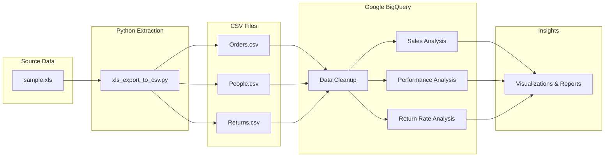

# Datasets Analysis Using BigQuery


> A complete data pipeline from raw Excel files to actionable business insights using **Python**, **Google BigQuery**, and **SQL**.

---

## Project Overview

This repository contains the complete ETL pipeline and analytical reporting for a sales dataset. The goal is to ingest raw transactional logs, normalize the data schema in **Google BigQuery**, and generate actionable insights regarding **Regional Manager Performance** and **Product Return Risks**.

---

## Pipeline Overview



---

## Tech Stack

| Technology | Purpose |
|------------|---------|
| **Python** (pandas) | Data extraction & CSV conversion |
| **Python** (google-cloud-bigquery) | Automated BigQuery upload |
| **Google BigQuery** | Cloud data warehouse |
| **SQL** | Data transformation & analysis |

---

## Repository Structure

```text
.
├── credentials/              <-- GCP service account credentials (gitignored)
├── datasets/
│   ├── Raw Data/
│   │   └── sample.xls        <-- Original dataset
│   ├── Cleaned Data/
│   │   ├── orders.csv        <-- Extracted Orders table (~9,000+ rows)
│   │   ├── people.csv        <-- Extracted People table (4 rows)
│   │   └── returns.csv       <-- Extracted Returns table (~300 rows)
│   ├── main.py               <-- Entry point script
│   ├── upload_csv_to_bigquery.py  <-- BigQuery upload automation
│   ├── xls_export_to_csv.py  <-- Excel to CSV conversion
│   ├── requirements.txt      <-- Python dependencies
│   └── .env                  <-- Environment configuration
├── docs/
│   ├── analysis_report.pdf   <-- Summary of findings
│   └── visuals/              <-- Chart visualizations
├── sql/
│   ├── normal_query_cleanup.sql
│   ├── people_performance_on_orders_and_returns.sql
│   ├── return_rate_analysis.sql
│   └── sales_costs_profit_analysis_on_Orders.sql
├── .gitignore
└── README.md
```

---

## Data Model & Schema

The analysis transforms raw CSV logs into a modified **Star Schema** optimized for reporting:

* **Fact Table:** `Orders` (Transactional sales data)
* **Dimension Tables:**
    * `People` (Regional Managers - *Cleaned & Renormalized*)
    * `Returns` (Return status flags)

---

## Step 1: Data Extraction (Python)

**Purpose:** Convert multi-sheet Excel file into separate CSV files for BigQuery ingestion.

**Script:** [`datasets/xls_export_to_csv.py`](datasets/xls_export_to_csv.py)

```python
import pandas as pd

# Read the Excel file
xls_file = pd.ExcelFile('sample.xls')

sheet_names = xls_file.sheet_names

# Loop through each sheet and save as csv
for sheet_name in sheet_names:
    df = pd.read_excel(xls_file, sheet_name=sheet_name)
    
    # Save as CSV with sheet name
    output_filename = f'{sheet_name}.csv'
    df.to_csv(output_filename, index=False, encoding='utf-8')
```

**Output:** 3 CSV files extracted from Excel sheets:

| File | Description | Records |
|------|-------------|---------|
| Orders.csv | Transactional sales data | ~9,000+ rows |
| People.csv | Regional Manager assignments | 4 rows |
| Returns.csv | Return status flags | ~300 rows |

---

## Step 2: Data Ingestion & Cleanup (SQL)

**Purpose:** Validate data quality and fix ingestion issues in BigQuery.

**Script:** [`sql/normal_query_cleanup.sql`](sql/normal_query_cleanup.sql)

### 2.1 Preview & Validate Tables
```sql
-- Row Counts for All Tables
SELECT 'orders' as table_name, COUNT(*) as row_count FROM `test.Orders`
UNION ALL
SELECT 'people', COUNT(*) FROM `test.People`
UNION ALL
SELECT 'returns', COUNT(*) FROM `test.Returns`;
```

### 2.2 Check for Null Values & Duplicates
```sql
-- Check null value on columns of Orders Table
SELECT 
  COUNTIF('Order ID' IS NULL) as null_order_ids,
  COUNTIF('Customer ID' IS NULL) as null_customer_ids,
  COUNTIF('Product ID' IS NULL) as null_product_ids
FROM `test.Orders`;

-- Check for duplicates in primary keys
SELECT `Order ID` as order_id, COUNT(*) as cnt
FROM `test.Orders`
GROUP BY order_id
HAVING cnt > 1;
```

### 2.3 Fix Malformed Headers (People Table)
```sql
-- Rename Column Names of People (fix ingestion issue)
CREATE OR REPLACE TABLE `test.People` AS
SELECT
  string_field_0 AS `Regional Manager`,
  string_field_1 AS Region
FROM `test.People`
WHERE string_field_0 != `Regional Manager` 
  AND string_field_0 IS NOT NULL;
```

> **Note:** The People table was ingested with generic column names (`string_field_0`, `string_field_1`) due to malformed headers. This was resolved using a CREATE OR REPLACE strategy.

---

## Step 3: Sales, Costs & Profit Analysis (SQL)

**Purpose:** Analyze revenue trends, regional performance, and profitability metrics.

**Script:** [`sql/sales_costs_profit_analysis_on_Orders.sql`](sql/sales_costs_profit_analysis_on_Orders.sql)

### 3.1 Monthly Revenue Trends
```sql
SELECT 
  FORMAT_DATE('%Y-%m', `Order Date`) as month,
  COUNT(*) as order_count,
  SUM(Sales) as monthly_revenue,
  AVG(Sales) as avg_order_value
FROM `test.Orders`
GROUP BY month
ORDER BY month;
```

### 3.2 Regional Sales Performance
```sql
SELECT 
  Region,
  SUM(Sales) as total_sales,
  AVG(Sales) as average_order_value
FROM `test.Orders`
GROUP BY Region
ORDER BY total_sales DESC;
```

### 3.3 Total Costs vs Profit
```sql
SELECT 
  SUM(Sales) as total_sales,
  SUM(Profit) as total_profit,
  SUM(Sales) - SUM(Profit) as total_costs
FROM `test.Orders`;
```

**Key Visualizations:**


---

## Step 4: Regional Manager Performance (SQL)

**Purpose:** Evaluate sales performance and profit margins by Regional Manager.

**Script:** [`sql/people_performance_on_orders_and_returns.sql`](sql/people_performance_on_orders_and_returns.sql)

### 4.1 Sales Performance by Manager
```sql
SELECT
  p.`Regional Manager` AS Regional_Manager,
  p.Region,
  ROUND(SUM(o.Sales), 2) AS Total_Sales,
  ROUND(SUM(o.Profit), 2) AS Total_Profit,
  COUNT(DISTINCT o.`Order ID`) AS Total_Orders,
  ROUND((SUM(o.Profit) / SUM(o.Sales)) * 100, 2) AS Profit_Margin_Pct
FROM `test.Orders` AS o
INNER JOIN `test.People` AS p ON o.Region = p.Region
GROUP BY 1, 2
ORDER BY Total_Profit DESC;
```

### 4.2 Data Integrity Check
```sql
-- Verify all orders have assigned managers
SELECT o.Region AS Order_Region, COUNT(o.`Order ID`) AS Orphaned_Orders
FROM `test.Orders` AS o
LEFT JOIN `test.People` AS p ON o.Region = p.Region
WHERE p.`Regional Manager` IS NULL
GROUP BY 1;
```

**Key Visualizations:**


---

## Step 5: Return Rate Analysis (SQL)

**Purpose:** Analyze product returns and their impact on profitability.

**Script:** [`sql/return_rate_analysis.sql`](sql/return_rate_analysis.sql)

### 5.1 Return Rate by Ship Mode
```sql
SELECT 
  o.`Ship Mode`,
  COUNT(DISTINCT o.`Order ID`) as total_orders,
  COUNT(DISTINCT r.`Order ID`) as returned_orders,
  ROUND(COUNT(DISTINCT r.`Order ID`) * 100.0 / COUNT(DISTINCT o.`Order ID`), 2) as return_rate_pct,
  SUM(o.Sales) - SUM(CASE WHEN r.Returned IS TRUE THEN o.Sales ELSE 0 END) as total_sales_after_return
FROM `test.Orders` o
LEFT JOIN `test.Returns` r ON o.`Order ID` = r.`Order ID`
GROUP BY o.`Ship Mode`
ORDER BY return_rate_pct DESC;
```

### 5.2 Profitability Impact by Category
```sql
SELECT 
  o.Category,
  SUM(o.Profit) as total_profit,
  SUM(CASE WHEN r.Returned IS TRUE THEN o.Profit ELSE 0 END) as lost_profit_due_to_return,
  ROUND(SUM(CASE WHEN r.Returned IS TRUE THEN o.Profit ELSE 0 END) * 100.0 / 
        NULLIF(SUM(o.Profit), 0), 2) as profit_loss_pct
FROM `test.Orders` o
LEFT JOIN `test.Returns` r ON o.`Order ID` = r.`Order ID`
GROUP BY o.Category
ORDER BY lost_profit_due_to_return DESC;
```

**Key Visualizations:**


---

## Key Insights

| Metric | Insight |
|--------|---------|
| **Data Quality** | 100% of orders mapped to valid regions after cleanup |
| **Regional Performance** | Significant variation in profit margins across managers |
| **Return Impact** | Product returns affect category profitability differently |
| **Monthly Trends** | Clear seasonal patterns in order volume and revenue |

---

## Getting Started

### Prerequisites
- Python 3.8+
- Google Cloud Platform account with BigQuery enabled
- Service account credentials with BigQuery access

### Setup
1. Clone the repository
2. Install dependencies:
   ```bash
   cd datasets
   pip install -r requirements.txt
   ```
3. Configure environment variables in `.env`:
   ```
   GOOGLE_APPLICATION_CREDENTIALS=path/to/credentials.json
   ```
4. Place your GCP service account JSON in the `credentials/` folder

### Running the Pipeline
1. **Extract CSV files from Excel:**
   ```bash
   python xls_export_to_csv.py
   ```
2. **Upload CSVs to BigQuery:**
   ```bash
   python upload_csv_to_bigquery.py
   ```
3. **Run SQL analysis scripts** in BigQuery console

---

## Challenges Encountered & Solutions

1. **Data Ingestion & Cleaning**
    - **Issue:** The People table was ingested with a malformed header row, resulting in generic column names (`string_field_0`, `string_field_1`) and a dirty first row.
    - **Solution:** Implemented a `CREATE OR REPLACE` strategy in `sql/normal_query_cleanup.sql` to filter out the artifact header row and explicitly cast and rename columns to business entities (`Regional Manager`, `Region`).

2. **Data Integrity**
    - **Validation:** Performed `LEFT JOIN` checks to ensure 100% of Orders map to a valid Region in the People table.
